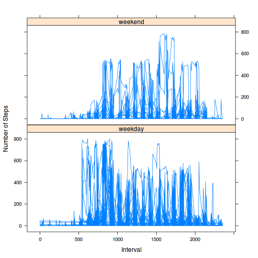

# Reproducible Research: Peer Assessment 1

This is my submission for Reproducible Research: Peer Assessment 1, 13 December, 2014.


## Loading and preprocessing the data

Files were forked and cloned from the [GitHub repository](http://github.com/rdpeng/RepData_PeerAssessment1) for this assignment, resulting in the data file `activity.csv`, which was loaded as follows:

```r
df <- read.csv("activity.csv", header=T)
c(dim(df), length(levels(df$date)), length(levels(as.factor(df$interval))))
```

```
## [1] 17568     3    61   288
```
There are 61 dates and 288 5-minute intervals in each date, resulting in 17568 rows. 

The interval column has the format hhmm with leading zeros removed. We can use this format for computations, but for display, we'd like the format hh:mm with leading zeros restored. So we add a new column, time, with this format:

```r
df$time <- sprintf("%04d",df$interval) # add leading zeros
df$time <-  gsub('(\\d\\d)(\\d\\d)', '\\1:\\2', df$time) # insert :
```

We'll need POSIX Date format in the last task but we will coerce it then.


## What is mean total number of steps taken per day?

To total the number of steps taken on each date, we use `aggregate()` omitting any missing data. 

```r
total.steps.by.date <- aggregate(steps ~ date, data=df, FUN=sum, na.action=na.omit)
dim(total.steps.by.date) 
```

```
## [1] 53  2
```
Evidently several days had missing `steps` data in every 5-minute interval, so this data frame has only 53 days, not the full 61 days.

A histogram will display the distribution of steps on each day, as well as report the mean and median steps over the measured days:


```r
hist(total.steps.by.date$steps, breaks=10,
     xlab='Steps per Day', ylab='Number of Days',
     main='Distribution of Total Steps per Day')

mn <- mean(total.steps.by.date$steps) # [1] 10766.19
md <- median(total.steps.by.date$steps) # [1] 10765
abline(v=mn, lwd=3)

text(5000, 15, paste('mean=', round(mn,2))) 
text(5000, 14, paste('median=', round(md,0)))
```

 

Over the days of this study, there were a mean of 1.0766189 &times; 10<sup>4</sup> steps per day; the median was 10765.


## What is the average daily activity pattern?

As well as steps per day, we can also look at steps per each of the 288 5-minute intervals. We can use `aggregate()` once again, but this time calculating the mean for each interval over all the days of the study. 


```r
mean.steps.by.interval <- aggregate(steps ~ interval, data=df, FUN=mean, na.action = na.omit)
```
We can then plot the average steps taken in each interval.

```r
plot(mean.steps.by.interval$interval, mean.steps.by.interval$steps,
     type='l', xaxt='n',
     xlab='Beginning of 5 minute interval',
     main='Mean Steps in Each Time Interval'
     )
# five x axis ticks
tick.ndx <- round(( dim(mean.steps.by.interval)[1] / 6) * (1:5), 0) + 1
tick.coord <- mean.steps.by.interval$interval[tick.ndx]
labels <- df$time[tick.ndx]
axis(side=1, at=tick.coord, labels=labels)
# calculate and display the maximum
max.ndx <- which.max(mean.steps.by.interval$steps)
max <- mean.steps.by.interval$steps[max.ndx]
text(1300, 200, paste('max = ', round(max,2), 'at', df$time[max.ndx]) )
```

 

The chart also displays the maximum average steps and when it occurs: the max of 206.17 occurs at 08:35.


## Imputing missing values

Recall that only 53 days out of 61 had steps data. For these 8 days at 288 intervals per day, there should be 8*288=2304 missing values.

```r
sum(!complete.cases(df))
```

```
## [1] 2304
```

We can impute values for the missing steps data, by using the average steps for that interval for each day and interval which is missing a value. The most straightforward way to do this is to replicate the average steps for each interval over the entire 61 days. Then assign that average to the missing intervals. As instructed, we do this in a new data frame.

```r
repeated.mean.steps <- rep(mean.steps.by.interval$steps, length.out=dim(df)[1])
df1 <- df
missing.ndx <- which(is.na(df$steps))
df1$steps[missing.ndx] <- repeated.mean.steps[missing.ndx]
```

This new data set with imputed values has 8 days additional data, all set to averages of the old data set. This should reduce the spread of the distribution, since the additional data will be concentrated nearer the mean. To check this, we can reproduce the histogram above, but including the imputed values of the new data set.

```r
total.steps.by.date <- aggregate(steps ~ date,
                           data=df1, FUN=sum, na.action = na.omit)
hist(total.steps.by.date$steps, breaks=10,
     xlab='Steps per Day', ylab='Number of Days',
     main='Imputed Distribution of Total Steps per Day')

mn <- mean(total.steps.by.date$steps)
md <- median(total.steps.by.date$steps)
abline(v=mn, lwd=3)
text(5000, 15, paste('mean=', round(mn,2))) 
text(5000, 14, paste('median=', round(md,2)))
```

 

The mean, 1.0766189 &times; 10<sup>4</sup>, and median, 1.0766189 &times; 10<sup>4</sup>, are about the same as before, but the spread of the distribution appears to have decreased.


## Are there differences in activity patterns between weekdays and weekends?

We can ask if activity levels differ between weekdays and weekends, since lifestyles differ between those days for many people. To do this, we calculate the day of the week for that data, and then create a new factor variable indicating if the date was a weekday or weekend.

```r
wday <- weekdays(as.Date(df$date))
df1$day <- ifelse(wday=='Saturday' | wday=='Sunday', 'weekend', 'weekday')
```

We can now chart the steps taken in each interval separtately for weekdays and weekends. The lattice package makes this very easy.

```r
library(lattice)
xyplot(steps ~ interval | day, 
       data=df1, layout=c(1,2), type='l',
       xlab='Interval', ylab='Number of Steps')
```

 

By visual inspection, there appears to be increased activity later in the day on weekends, and earlier in the day on weekdays.


